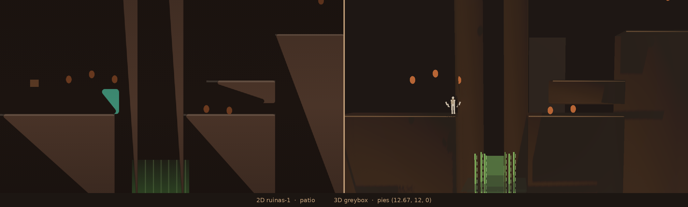
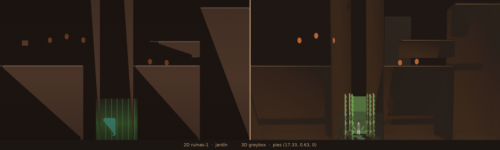
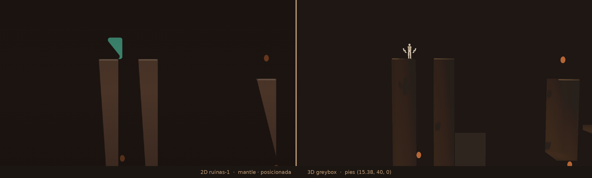
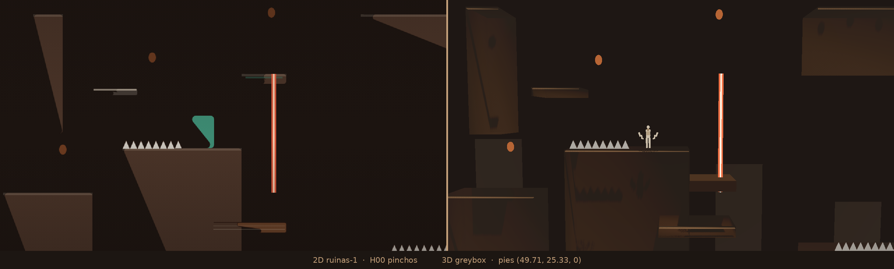
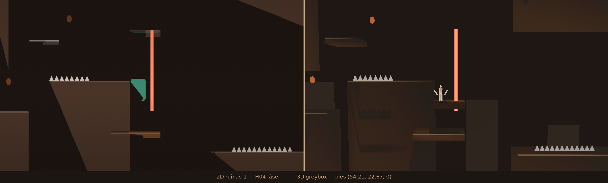

# Comparativo 2D / 3D — Ruinas de Kakaw (`ruinas-1`)

Piloto greybox Godot 4.2. Escala **24 px = 1 m**. Y 2D hacia abajo; Y Godot hacia arriba. Pies de Maya: centro X del hitbox, base Y (`PH = 42`). Profundidad greybox de los sólidos: 64 px = 2.6667 m, centrada en z = 0.

## Fuente

El pin pedido `NadiaCoelloO/sand-vivid-dawn-sail@5fd45031` no se pudo leer desde aquí (404). El layout y los timings salen de `NadiaCoelloO/Cacao.Game@77e55b5278` `levels.ts` / `sim.ts` (`ruinas-1`, `linkSecrets`, `sitSpikes`, `freeCoins`). QA confirmó que ese pin coincide con lo usado: geometría con 0 faltantes. Los oneways de `selva-1` de ese archivo coinciden con `docs/ONEWAY_DELTA_selva.md`.

`jardin-1` y `pichincha-1` no existen en este proyecto. El warp deja un log y devuelve a Maya al último spawn. No congela la escena.

## Cámara

El `@export camera_offset` de Godot se descarta si está escrito **antes** de `script =`. En esa posición el runtime se quedaba en el default `(0, 1, 12)` (~20 × 11 m) mientras el clampeo ya estaba armado para 22.5 m. En `pilot_ruinas.tscn` el valor quedó debajo de `script =`, y `_ready` de la escena lo vuelve a asignar. `player_maya.gd` no se tocó. El `fov` sigue en 50.

| | valor |
|---|---|
| fov | 50° vertical |
| camera_offset | (0, 1, **24.1256**) m, leído en runtime |
| alto de fórmula | 2 × 24.1256 × tan(25°) = **22.50 m** |
| alto en el plano z = 0 | **22.55 m** (el offset sube 1 m, el rayo no es perpendicular al plano de juego) |
| ancho en z = 0 | **40.03 m** |
| Maya, hitbox 1.75 m (42 px) | patio, h00 y h04 **55.7 px**; jardín **54.1 px** (queda abajo del cuadro); mantle **56.7 px**. Viewport 1280×720 |

Eso iguala la ventana 2D de 960×540 px (1 m = 32 px, 42 px × 720/540 = 56 px). Después del follow, la escena clampea el foco a x en [20, 180] m y y en [11.25, 36.75] m: la misma ventana de 40 × 22.5 m pegada al borde del nivel. El look-ahead de 2 m sigue siendo el del script.

## Tomas

Misma pose en los dos renders. 2D: `renderGame`, 960×540, `camLook = 48`, `time = 0`, escalado nearest a 1280×720. 3D: viewport 1280×720, HUD oculto, 60 frames para asentar el follow y el clampeo. La forma teal del 2D es Maya (`character.color` `#3d8a72` porque el preview no carga sprites). En 3D Maya queda crema, con el fill y el rim de LOOK-001 en la capa 2.

| id | pies 2D | pies 3D m | nota |
|---|---|---|---|
| patio | (291, 822) | (12.6667, 12, 0) | Patio inicial, techo de arrastre y pozo |
| jardin | (403, 1095) | (17.3333, 0.625, 0) | Secreto jardín: caída entre los muros |
| mantle | (356, 150) | (15.375, 40, 0) | Corona del muro izquierdo, posicionada (Maya no llega jugando) — posicionada, no jugada |
| h00 | (1180, 502) | (49.7083, 25.3333, 0) | Pinchos H00 sobre el bloque grande |
| h04 | (1288, 566) | (54.2083, 22.6667, 0) | Láser H04 junto a la plataforma móvil |

## Perf (vista de juego, OpenGL llvmpipe)

`FogVolume` avisa `shader type fog not supported` en este renderer. La niebla de profundidad del `Environment` y las láminas del pozo sí salen en el PNG. En Forward+ el volumen del pozo también está.

| toma | tris | draws | tris mundo | draws mundo |
|---|---:|---:|---:|---:|
| patio | 2737 | 143 | 1382 | 107 |
| jardin | 2683 | 155 | 1328 | 119 |
| mantle | 2273 | 108 | 918 | 72 |
| h00 | 2911 | 117 | 1556 | 81 |
| h04 | 2771 | 119 | 1416 | 83 |

Los granos van por instancia para poder ocultarlos al recogerlos. El bisel, las lianas y el núcleo del láser suman draws. Sigue muy por debajo del techo de 180k tris. El draw count queda por encima de 80 porque cada grano y cada adorno es su propio mesh.

## Jugabilidad cableada

Valores copiados de `sim.ts`. Nada de esto toca `player_maya.gd`.

| pieza | comportamiento |
|---|---|
| pinchos H00–H03 | overlap del hurtbox `(x+4, y+8, w-8, h-10)` → `kill` |
| láseres H04–H06 | igual, solo si `(time+phase) % period < period*0.42`. El dibujo cubre el AABB: 0.4167 m en `#E85A3A` alpha 0.88, núcleo `#FFF0D2` de 0.125 m |
| kill | vidas 5, `invuln` 0.8, `hitstop` 0.08, `deathT` 0.55, respawn con `invuln` 1.1. A 0 vidas, `over` |
| caída del nivel | pies bajo `-(80+42)/24` m (−5.08 m). Resta una vida, igual que `p.y > level.height + 80`. El `kill_y` de Maya en esta escena está en −1000 para que ese respawn instantáneo (sin vida) no dispare |
| monedas | distancia al centro < 28 px. Se ocultan |
| K01 | salto lo activa, guarda el spawn (`x+4`, pies en la base del poste), `poleLock` 0.35 s, texto «Partida guardada» |
| K00 | primer salto guarda y avisa «Tótem guardado — W otra vez». El siguiente loguea `pichincha-1`, reaparece en el último spawn y queda en lock 0.4 s (`poleLockT` del poste) para no dispararse otra vez en el tick siguiente. No congela |
| F00 | overlap loguea `jardin-1`, marca la caída como usada y reaparece en el último spawn. No resta vida y no congela |
| G00 | overlap marca la meta, oculta el grano y deja `win` 1.35 s |
| one-way | la colisión se apaga si los pies están bajo `top−0.06`, y también mientras `_drop_timer > 0` (abajo+salto, 0.18 s). El timer lo arma Maya; la escena lo lee al inicio del tick siguiente, todavía dentro de esa ventana |
| crumble / móviles | sin cambio: 0.46 s / 2.7 s, y `sin`/`cos` del 2D |

## Equivalencias

Geometría: las 25 plataformas, 7 peligros, 21 pickups, 2 postes, 1 meta y 1 caída siguen presentes. Centro y tamaño en metros. Los móviles están en t = 0.

### Plataformas

| id | kind | tag | AABB 2D px | centro 3D m | tamaño 3D m | top m |
|---|---|---|---|---|---|---:|
| P00 | solid | suelo de entrada | (0, 864, 320, 288) | (6.667, 6, 0) | (13.33, 12, 2.667) | 12 |
| P01 | solid | muro de escalada izquierdo del pozo | (320, 192, 64, 960) | (14.67, 20, 0) | (2.667, 40, 2.667) | 40 |
| P02 | solid | muro de escalada derecho del pozo | (448, 192, 64, 960) | (20, 20, 0) | (2.667, 40, 2.667) | 40 |
| P03 | solid | suelo tras el pozo | (512, 864, 256, 288) | (26.67, 6, 0) | (10.67, 12, 2.667) | 12 |
| P04 | solid | techo de arrastre (crawlCover, gap 30 px) | (576, 770, 192, 64) | (28, 14.58, 0) | (8, 2.667, 2.667) | 15.92 |
| P05 | solid | bloque medio | (768, 640, 192, 512) | (36, 10.67, 0) | (8, 21.33, 2.667) | 21.33 |
| P06 | solid | columna | (832, 256, 64, 256) | (36, 32, 0) | (2.667, 10.67, 2.667) | 37.33 |
| P07 | solid | bloque grande | (1024, 544, 256, 608) | (48, 12.67, 0) | (10.67, 25.33, 2.667) | 25.33 |
| P08 | oneway | one-way | (960, 416, 96, 18) | (42, 30.29, 0) | (4, 0.75, 2.667) | 30.67 |
| P09 | crate | caja | (1216, 704, 160, 22) | (54, 18.21, 0) | (6.667, 0.9167, 2.667) | 18.67 |
| P10 | moving | plataforma móvil vertical | (1280, 608, 96, 22) | (55.33, 22.21, 0) | (4, 0.9167, 2.667) | 22.67 |
| P11 | solid | repisa alta | (1536, 256, 320, 128) | (70.67, 34.67, 0) | (13.33, 5.333, 2.667) | 37.33 |
| P12 | solid | suelo bajo la repisa | (1536, 768, 320, 256) | (70.67, 10.67, 0) | (13.33, 10.67, 2.667) | 16 |
| P13 | crumble | piedra que cede (alta) | (1920, 576, 128, 448) | (82.67, 14.67, 0) | (5.333, 18.67, 2.667) | 24 |
| P14 | oneway | one-way | (2112, 448, 160, 22) | (91.33, 28.88, 0) | (6.667, 0.9167, 2.667) | 29.33 |
| P15 | solid | suelo del poste secreto pichincha | (2368, 640, 192, 384) | (102.7, 13.33, 0) | (8, 16, 2.667) | 21.33 |
| P16 | crumble | piedra que cede | (2624, 544, 128, 22) | (112, 24.88, 0) | (5.333, 0.9167, 2.667) | 25.33 |
| P17 | moving | plataforma móvil horizontal | (2880, 448, 128, 22) | (122.7, 28.88, 0) | (5.333, 0.9167, 2.667) | 29.33 |
| P18 | solid | bloque ancho | (3328, 576, 320, 448) | (145.3, 14.67, 0) | (13.33, 18.67, 2.667) | 24 |
| P19 | oneway | one-way | (3456, 384, 96, 18) | (146, 31.62, 0) | (4, 0.75, 2.667) | 32 |
| P20 | solid | suelo del paso bajo | (3776, 704, 192, 320) | (161.3, 12, 0) | (8, 13.33, 2.667) | 18.67 |
| P21 | solid | techo de arrastre estrecho (squeezeCover, gap 18 px) | (3776, 622, 160, 64) | (160.7, 20.75, 0) | (6.667, 2.667, 2.667) | 22.08 |
| P22 | solid | bloque | (4032, 512, 128, 512) | (170.7, 16, 0) | (5.333, 21.33, 2.667) | 26.67 |
| P23 | solid | columna alta | (4032, 192, 64, 192) | (169.3, 36, 0) | (2.667, 8, 2.667) | 40 |
| P24 | solid | suelo de meta | (4288, 384, 512, 640) | (189.3, 18.67, 0) | (21.33, 26.67, 2.667) | 32 |

- P10 reposo px (1280, 384) amp (0, 224) periodo 4 fase 0. t = 0 → (1280, 608, 96, 22).
- P17 reposo px (2880, 448) amp (224, 0) periodo 3.1 fase 0. t = 0 → (2880, 448, 128, 22).

### Peligros

| id | kind | AABB 2D px | centro 3D m | tamaño XY m | periodo | fase |
|---|---|---|---|---|---|---|
| H00 | spikes | (1024, 527, 128, 18) | (45.33, 25.67, 0) | 5.333 × 0.75 | — | — |
| H01 | spikes | (1600, 751, 192, 18) | (70.67, 16.33, 0) | 8 × 0.75 | — | — |
| H02 | spikes | (2432, 623, 128, 18) | (104, 21.67, 0) | 5.333 × 0.75 | — | — |
| H03 | spikes | (3392, 559, 128, 18) | (144, 24.33, 0) | 5.333 × 0.75 | — | — |
| H04 | laser | (1344, 384, 10, 256) | (56.21, 26.67, 0) | 0.4167 × 10.67 | 2.4 | 0 |
| H05 | laser | (2752, 512, 10, 256) | (114.9, 21.33, 0) | 0.4167 × 10.67 | 2.8 | 0.5 |
| H06 | laser | (3776, 256, 10, 320) | (157.5, 30.67, 0) | 0.4167 × 13.33 | 2.2 | 0.3 |

### Pickups

Elipsoides `#8B4A2B`, brillo leve. Radio de recogida 28 px. El radio visual no es el de la esfera dorada anterior.

| id | centro 2D px | centro 3D m |
|---|---|---|
| C00 | (192, 768) | (8, 16, 0) |
| C01 | (256, 752) | (10.67, 16.67, 0) |
| C02 | (320, 768) | (13.33, 16, 0) |
| C03 | (396.8, 512) | (16.53, 26.67, 0) |
| C04 | (576, 852) | (24, 12.5, 0) |
| C05 | (640, 852) | (26.67, 12.5, 0) |
| C06 | (896, 544) | (37.33, 25.33, 0) |
| C07 | (864, 192) | (36, 40, 0) |
| C08 | (1088, 352) | (45.33, 33.33, 0) |
| C09 | (1344, 256) | (56, 37.33, 0) |
| C10 | (1600, 160) | (66.67, 41.33, 0) |
| C11 | (1664, 151.34) | (69.33, 41.69, 0) |
| C12 | (1728, 151.34) | (72, 41.69, 0) |
| C13 | (1792, 160) | (74.67, 41.33, 0) |
| C14 | (2176, 352) | (90.67, 33.33, 0) |
| C15 | (2496, 626) | (104, 21.92, 0) |
| C16 | (2944, 352) | (122.7, 33.33, 0) |
| C17 | (3520, 288) | (146.7, 36, 0) |
| C18 | (3840, 608) | (160, 22.67, 0) |
| C19 | (4096, 128) | (170.7, 42.67, 0) |
| C20 | (4480, 288) | (186.7, 36, 0) |

### Secretos, postes y meta

| id | qué | AABB 2D px | centro 3D m |
|---|---|---|---|
| K00 | poste secreto → pichincha | (2368, 568, 36, 72) | (99.42, 22.83, 0) |
| K01 | poste | (3552, 504, 36, 72) | (148.8, 25.5, 0) |
| G00 | meta cacao | (4608, 328, 48, 56) | (193, 33.17, 0) |
| F00 | caída → jardin | (368, 992, 160, 192) | (18.67, 2.667, 0) |

Spawn 2D (96, 768) → pies (4.5417, 14.25, 0).

## Ruta de Maya

P01 y P02 son muros de 40 m (px y 192, alto 960) que cierran el pozo de lado a lado. El salto de Maya es `jumpVel` 720 px con `GRAV_UP` 2100: cerca de 5.1 m, y un doble cerca de 10 m. Desde el suelo de entrada (top 12 m) la corona queda a 28 m. No hay wall-jump: implementarlo exige `player_maya.gd`, y eso queda para un OK de Nadia. La escalada de Nix (`character id == "nix"`) no está en Maya, y el pound de la caja P09 tampoco.

Con mantle solo, Maya no cruza el pozo ni sube a la corona. La toma `mantle` está **posicionada**, no jugada. La ruta hacia la meta, que pasa esos muros, queda **bloqueada** para Maya.

## One-way y mantle

En el 2D los one-way no entran en `solids()`, así que el mantle no los agarra. En 3D, `_nearby_solids` y `_blocked_rect` consultan `collision_mask`, el mismo mask con el que Maya se para en el piso. Sacar P08, P14 y P19 de esa consulta sin perder el suelo implica cambiar `player_maya.gd`. No se tocó. Siguen siendo suelo de one-way, y el mantle todavía puede verlos.

## Look

Fondo `#1E1714`. Niebla de profundidad `#2C241E` (marrón, no tiñe de verde los muros cercanos). Piedra `#4A382C`, labio `#6B5440`, bisel claro en la arista superior delantera. Sol cenital cálido, energía 0.42, sombras. El verde queda en el pozo: haz corto desde el suelo, lámina emisiva, lianas claras con alpha-scissor (hueco alrededor de x ≈ 17.3) y musgo en la base. La cara cercana de la piedra (la que tapa a Maya) se descarta con dither solo donde cae sobre ella; la colisión no se mueve. Pinchos: triángulos `#C9C4BC` con borde `#2C1810`, sin emisión. Láser: el ancho del hurtbox, 0.4167 m, `#E85A3A` al 0.88, núcleo `#FFF0D2` de 0.125 m. Cacao: óvalo de frente a cámara, el mismo tamaño que la elipse 2D (16×22 px a 540, **20×30 px** en el patio a 720p), `#8B4A2B` con un poco de `#C46A3A`. El radio de recogida sigue en 28 px. El pozo tiene un fondo verde entre las lianas. Fill y rim de Maya, `cull_mask` solo de su capa, colores de LOOK-001.

## Pendiente

| pieza | estado |
|---|---|
| geometría del 2D | completa |
| pinchos, láser, monedas, K01, G00, drop-through | cableados |
| warp K00 / F00 | stub con log y respawn al último spawn. No hay `pichincha-1` ni `jardin-1`. No congela |
| caída fuera del nivel | resta una vida |
| caja P09 pound | no. Maya no tiene pound |
| escalada Nix en P01/P02 | no. Diferencia de personaje |
| wall-jump | no. Haría falta el OK de Nadia para tocar `player_maya.gd` |
| ruta pasado el pozo | bloqueada para Maya |
| one-way fuera del mantle | no hecho. Hace falta `player_maya.gd` |

